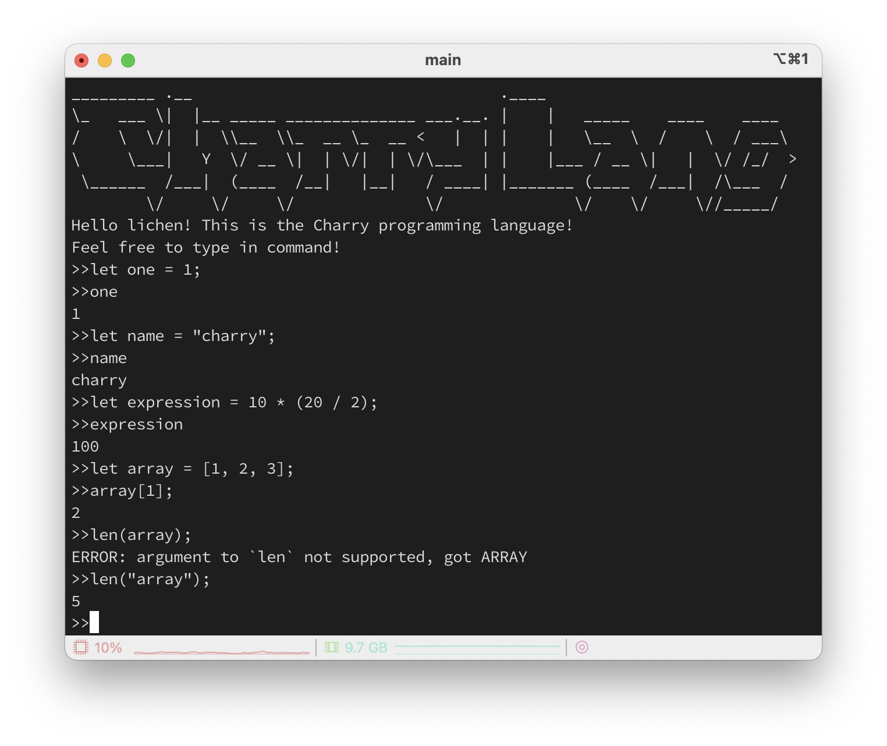
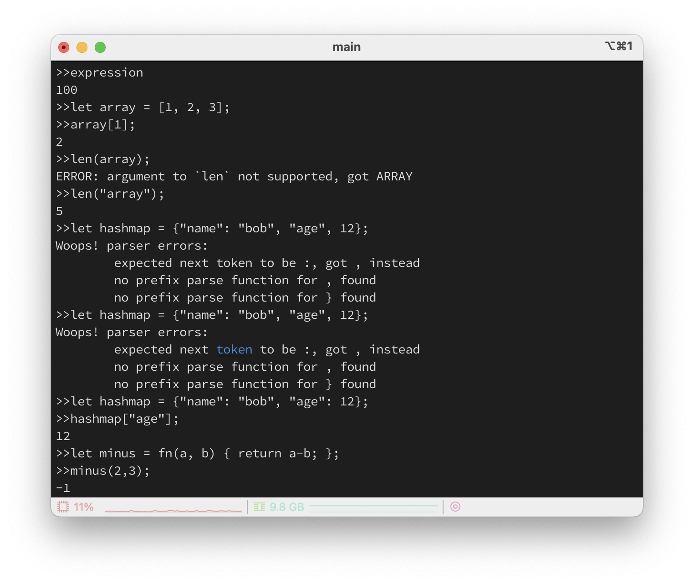
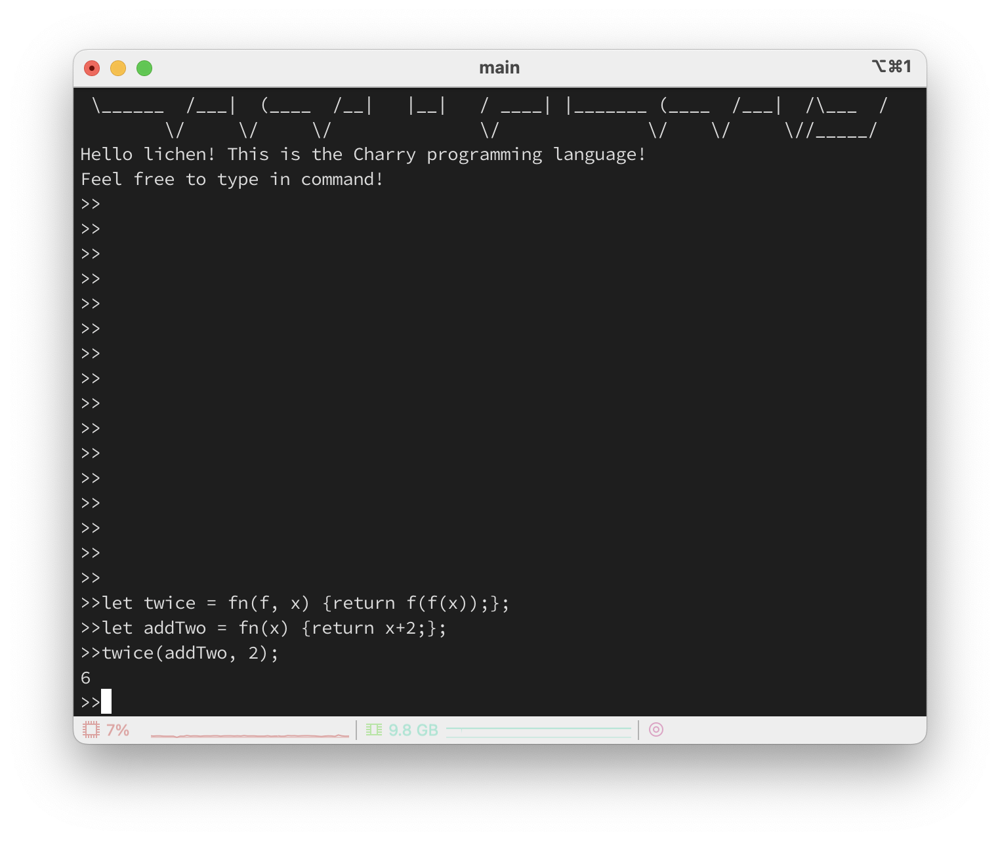

# Charrylang: A Programming Language Made by Charry

## 0. Overview

Charrylang is a programming language made by Charry. It is an interpreted language. That means its interpreter is created by myself.

## 1. Features

It has(will have) amazing features:
* C-like syntax;
* Variables binding;
* Integers & booleans;
* Arithmetic expressions;
* Built-in functions;
* Higher-order functions;
* Closures;
* A string data structure;
* An array data structure;
* A hash data structure;

## 2. Demo

Here is a charrylang example:

```go
let one = 1;
let name = "charry";
let expression = 10 * (20 / 2);
let array = [1, 2, 3];
let hashmap = {"name": "bob", "age": 12};
hashmap["age"]; // => 12
let minus = fn(a, b) { return a-b; };
minus(2,3);
let twice = fn(f, x) {
    return f(f(x));
};
let addTwo = fn(x) {
    return x+2;
};
twice(addTwo, 2);   // => 6
```

Running results on my computer:





There are some simple tips for error handling.

## 3. Dive into charrylang's interpreter

Components in this interpreter:
* Lexer;
* Parser;
* AST;
* Internal Object System;
* Evaluator;
* REPL;

## 4. Pros & Cons

Pros:
* No third-party dependency required;
* Comprehensive test instances;
* Self-explained code;

Cons:
* Simple debugging log;
* No support for float number type;