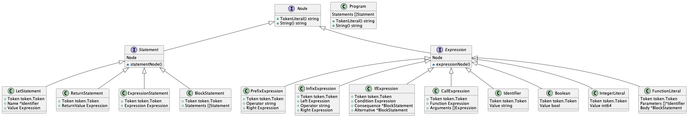

# AST

## UML


Maybe a little compicated? Not at all!

## Interfaces

What is interface in go? As *The Go Programming Language* said:

> “Interface types express generalizations or abstractions about the behaviors of other types. They are *satisfied implicitly.*"

For short, interface declares a set of necessary methods without specific implementations that some types should impletment. Interface is a boss that declares his employees but not tells them how to do.

Come back to our project. There are three different interfaces: Node, Statement, and Expression. They represent three different behaviors and status in abstract syntax tree. 

Node is our root! Everything in AST is a node. As a node, it should have these two method: TokenLiteral and String. TokenLiteral can return literal of node's token, which is a string. String method can return the representation of a node as plain string. It is very similar to `.String()` method in Java, which should be overrided when creating a class.

Statement is one important type in AST. Statement is a basic unit for our program. It has two members: Node and method statementNode(). It is a node, too. Thus it should contain a Node. And there is a method `statementNode()` method which is reserved for further development. Thanks to this method, it is easy to know which interface some structs apply. Every struct that applies Statement interface has a method statementNode().

Expression is the other important type in AST. It is very similar to Statement interface. It also has two members: Node and method expressionNode(). Ah, yea, I assure that every reader knows the usage of these two members.

For structs apply Statement interface, it should contain three methods compulsorily: statementNode, TokenLiteral, and String. For structs apply Expression interface, it should contain three methods compulsorily: expressionNode, TokenLiteral, and String. The UML diagram doesn't show these mehods in classes due to the limit of page size.

## Statements

### 0. Overview

In charrylang, there are three different types of statements, and block statement which is a set of statements.

```go
let x = 3;		// let statement
return x;		// return statement
1 + 2;			// expression statement

// block statement
{
  let x = 3;
  let y = 4;
  return x+y;
}
```

### 1. Let statement

Let statement is used to declare a variable and assign it a specific value. It has three members.

| Name  | Description                                         |
| ----- | --------------------------------------------------- |
| Token | a token that marks a let statement, should be "LET" |
| Name  | the name of variable                                |
| Value | the value of variable, it is a expression           |

The structure of a let statement:

```
let <name> = <expression>
```

### 2. Return statement

Return statement is used to return a value. It has two members.

| Name        | Description                                               |
| ----------- | --------------------------------------------------------- |
| Token       | a token that marks a return statement, should be "RETURN" |
| ReturnValue | the value of return content, it is a expression           |

The structure of a return statement:

```
return <expression>
```

### 3. Expression statement

Just like other programming languages that contain REPL, a simple expression can be a statement. It is easy to understand. An expression like '1 + 2' is accepted as a statement in Python REPL and can get its result '3' as response.

It has two members.

| Name       | Description                                                  |
| ---------- | ------------------------------------------------------------ |
| Token      | a token that marks an expression statement. it is the first token of expression |
| Expression | the expression itself                                        |

The structure of an expression statement:

```
<expression>
// token is the first token of the expression
```

### 4. Block statement

Block statement is a set of statements in braces. It is very important when parsing function literals and call expressions. It has two members.

| Name       | Description                                              |
| ---------- | -------------------------------------------------------- |
| Token      | a token that marks a block statement, should be "LBRACE" |
| Statements | a set of statements in braces                            |

The structure of a block statement:

```
{ // the token of block statement
 ... // statements
}
```

## Expression

### 0. Overview

In order to keep our language simple, values, literals, and identifiers which may not produce values are seen as expressions. This is a simple but worked design.

### 1. Identifier

Identifier is very common in charrylang. Like other programming languages, variable name and function parameter are seen as identifiers. Charrylang consider them as expression although they doesn't produce variable anymore. It has two members.

| Name  | Description                                                  |
| ----- | ------------------------------------------------------------ |
| Token | a token that marks an identifier expression, should be "IDENT" |
| Value | a string that represent the identifier, i.e. token.literal in fact |

The structure of a block statement:

```
foo // variable name
fuction(param1) // parameter name like 'param1'
```

### 2. Boolean

Boolean is also a must-have in every programming language. It stores a boolean's literal (a part of token in charry lang) and real value (boolean value in go). Theregfore, it has two members.

| Name  | Description                                                  |
| ----- | ------------------------------------------------------------ |
| Token | a token that contains a boolean's literal (true or false), should be "IDENT" |
| Value | a value that contains real bool value in go which can be handled in father language |

### 3. IntegerLiteral

IntegerLiteral can represent an integer as an expression. It is an important component in expression. For example, '2' and '3' are both integer literals in expression '2 + 3'. It has two members.

| Name  | Description                                                  |
| ----- | ------------------------------------------------------------ |
| Token | a token that marks an integer literal, should be "INT"       |
| Value | a value that contains real int value in go which can be handled in father language |

### 4. FunctionLiteral

FunctionLiteral is used to represent a function. Function can be an expression that produces value in charrylang. As a matter of fact, there are many programming languages, especially modern ones, having such feature. It has three members.

| Name       | Description                                                  |
| ---------- | ------------------------------------------------------------ |
| Token      | a token that marks a function literal, should be "FUNCTION"  |
| Parameters | a set of identifers' pointers that represent parameters of the function, can be nil |
| Body       | a block statement that represent body of the function        |

The structure of function literal is:

```
fn(x, y) {x + y;} // "fn" (parameters) {body}
```

### 5. PrefixExpression

PrefixExpression can represent expressions which don't have any expression on the left of operator. It has three members.

| Name     | Description                                                  |
| -------- | ------------------------------------------------------------ |
| Token    | a token that marks a prefix expression, the type follows first token in this expression, which can be '-' or others. |
| Operator | operator in the prefix expression                            |
| Right    | the value on the right of operator, which is an expression   |

The structure of prefix expression is:

```
<operator><value>

// example
-3
!true
```

### 6. InfixExpression

InfixExpression can represent expressions which have values on the left and right of operator. It is one of  core expressions in charrylang. It has four members.

| Name     | Description                                                  |
| -------- | ------------------------------------------------------------ |
| Token    | a token that marks an infix expression, which is the operator of the infix expression |
| Left     | expression on the left of operator                           |
| Operator | operator of the infix expression                             |
| Right    | expression on the right of operator                          |

The structure of infix expression is:

```
<left> <operator> <right>
```

It is designed to be a recursive container. That means, we use a top down operator precedence parsing method to generate an AST recursively. It will be discussed in detail in **Parser.md**.

### 7. IfExpression

IfExpression can represent an if-else expression. If-else expression is the foundation for flow-control in every programming language. So does charrylang. It has four members.

| Name        | Description                                                  |
| ----------- | ------------------------------------------------------------ |
| Token       | a token that marks an if expression, should be "IF"          |
| Condition   | an expression that represent a condition, should produce a boolean result |
| Consequence | a block statement which will be executed if the condition is true |
| Alternative | an optional block statement which will be executed if the condition is false |

The structure of If expression is:

```go
if (x > 3) {
  // ...
} else {
  // ...
}
```

### 8. CallExpression

CallExpression can represent the invocation of a function. It has three members.

| Name      | Description                                                  |
| --------- | ------------------------------------------------------------ |
| Token     | a token that marks a call expression, should be "LPAREN"     |
| Function  | the expression which represents the function                 |
| Arguments | a set of expressions that represent arguments in call expression |

The structure of Call expression is:

```
functionname(arg1, arg2, ...)
```
