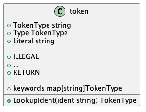

# Token.md

## UML

## Types

| Type      | Description                                                  |
| --------- | ------------------------------------------------------------ |
| TokenType | A string that defines the type of the token, can be `IDENT`(identifier), `INT`(integers), `RETURN`(keyword return), `GT`(operator <), and so on |
| Literal   | A string that contains literal data of the token. For example, Literal should be "let" if it is a LET token |
| Token     | A struct that represents a token in program. It contains two attributes, TokenType and Literal |

## Constants

It contains some constants to represent some token type.

## Variables

It contains a variable called `keyboard`. It is a `map[string]TokenType` variable. You can use literals such as "let" to find its TokenType `LET`.

## Methods

`LookupIdent(ident string) TokenType` can use a string called `ident` to find its Identifier, which is a TokenType. It is one of our core methods.
